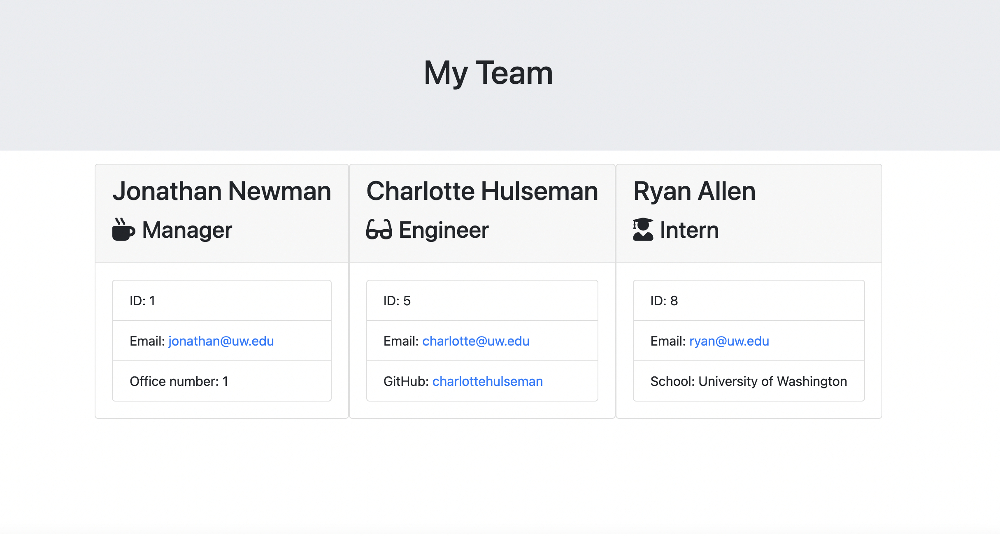

# Team Profile Generator 
## Description
This application allows a user to create a team based on role that has basic information for each employee. When a manager opens this program, they are asked for their name, email, id number, and office number. Then they can choose which employee role that they want to add and input each role's information. After they are done creating their team, an HTML is created with all of the entered information. On the created site, the manager can send an email to any of the employees, as well as access engineers' GitHub accounts.

## Table of Contents
* [Installation](#installation)
* [Usage](#usage)
* [Contributing](#contributing)
* [Tests](#tests)
* [License](#license)
* [Questions](#questions)

## Installation
Install npm inquirer to run this program.

## Usage

## Contributing

## Tests
Install npm jest to run the tests for this program.

## License
This project is licensed under MIT.

## Questions
Here is a link to my [GitHub](https://github.com/kelliekumasaka) or shoot me an [email](mailto:kelliek3@uw.edu).
